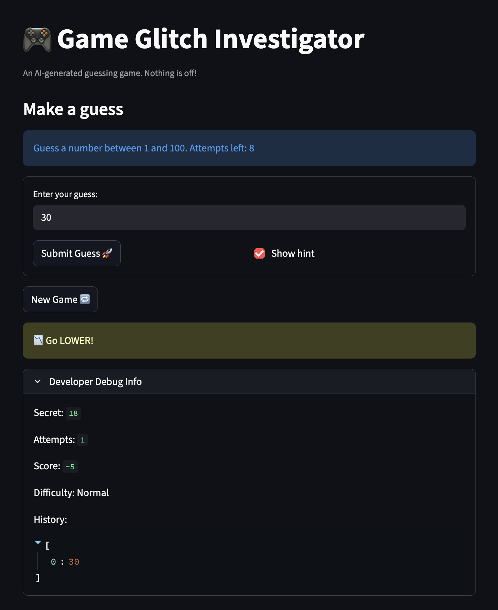
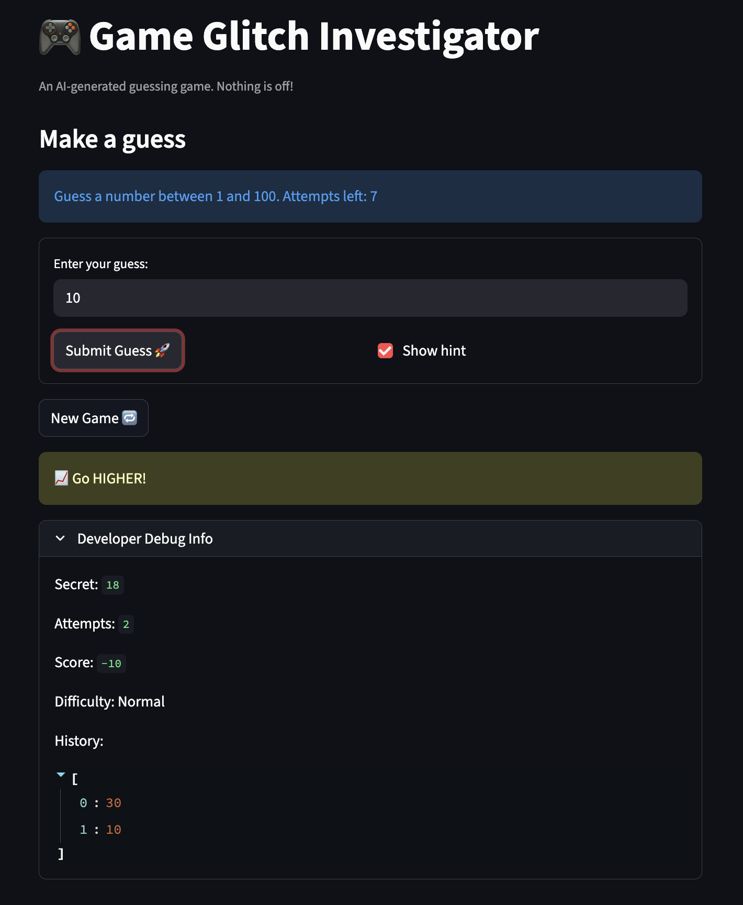
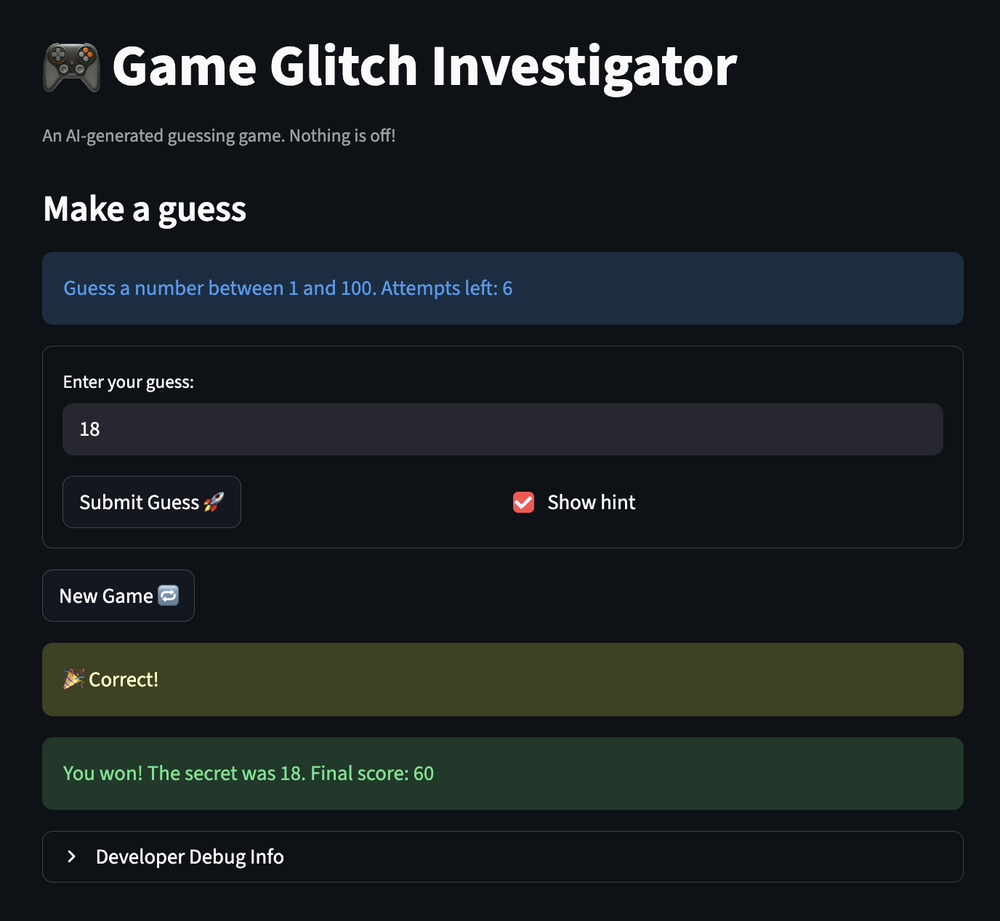

# 🎮 Game Glitch Investigator: The Impossible Guesser

## 🚨 The Situation

You asked an AI to build a simple "Number Guessing Game" using Streamlit.
It wrote the code, ran away, and now the game is unplayable. 

- You can't win.
- The hints lie to you.
- The secret number seems to have commitment issues.

## 🛠️ Setup

1. Install dependencies: `pip install -r requirements.txt`
2. Run the broken app: `python -m streamlit run app.py`

## 🕵️‍♂️ Your Mission

1. **Play the game.** Open the "Developer Debug Info" tab in the app to see the secret number. Try to win.
2. **Find the State Bug.** Why does the secret number change every time you click "Submit"? Ask ChatGPT: *"How do I keep a variable from resetting in Streamlit when I click a button?"*
3. **Fix the Logic.** The hints ("Higher/Lower") are wrong. Fix them.
4. **Refactor & Test.** - Move the logic into `logic_utils.py`.
   - Run `pytest` in your terminal.
   - Keep fixing until all tests pass!

## 📝 Document Your Experience

- [ ] Describe the game's purpose.
   - This is a simple number guessing game where the player has to guess a secret number between a certain range based on the selected difficulty level. The game provides hints to the player whether their guess is too high or too low compared to the secret number. The player wins by guessing the correct number within the allowed number of attempts, and their score is calculated based on many guesses it takes to win!
- [ ] Detail which bugs you found.
   - The first bug I found was that the hints were incorrect. When I made a guess that was too high, the game would tell me to go lower, and when I made a guess that was too low, it would tell me to go higher. This was very confusing and made it difficult to play the game.
   - The second bug I found was that the game accepted my guess on the first try, but for each subsequent guess, I had to click submit twice for it to register. This was very frustrating and made the game feel unresponsive. On the first submit click, it would enter my previous guess number into the developer debug info history. On the second click, it registered the actual new guess.
   - The third bug I found was that if I guessed correctly, the final score that it shows me in the "You won!" message is different from the score that is shown in the developer debug info. The score in the debug info is correct, but the score in the "You won!" message is incorrect.
- [ ] Explain what fixes you applied.
   - To fix the hint logic, I refactored the `check_guess` function into `logic_utils.py` and swapped the conditions for returning "Higher" and "Lower". Now, if the guess is less than the secret number, it returns "Higher", and if the guess is greater than the secret number, it returns "Lower". This fixed the issue with the hints being incorrect.
   - To fix the issue with having to click submit twice, I looked at the code in `app.py` and realized that the problem was that the game was updating the history of guesses in the developer debug info before it was actually registering the new guess. I moved the line of code that updates the history to after the line of code that registers the new guess. This way, when I click submit, it first registers my new guess and then updates the history with that new guess, which fixed the issue of having to click submit twice.
   - To fix the issue with the score being different in the "You won!" message compared to the developer debug info, I looked at how the score was being calculated in `logic_utils.py`. I found that there was an error in how points were being deducted based on attempts. I removed an extra deduction of 10 points that was happening on every win, which caused the score in the "You won!" message to be incorrect. Now, when I win, both the "You won!" message and the developer debug info show the same correct score.

## 📸 Demo

### Demo: "Go Lower!" Hint

### Demo: "Go Higher!" Hint

### Demo: Winning the Game

